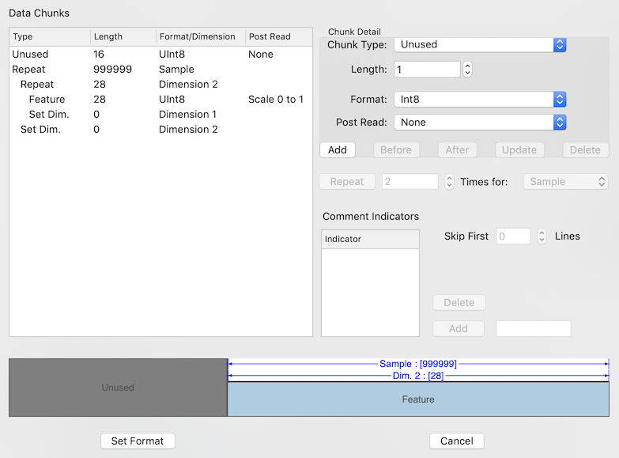

# File Data Format

When the 'Set Format' button is clicked the File Data Format sheet is presented.  You use this sheet to define the format of both binary and text files.  Below is an image of the sheet for the input files for the MNIST Reader project.  The input file contains 60000 (there are 10000 in the test input file) 28x28 grey-scale images presented in row-order format, preceded by 16 bytes of sizing information.

The data size (input size or output size depending on what the sheet was activated for) must be known prior to entering the format.

On the right side is a tabular list of 'chunks' that the file, or text line if a textual file is being parsed, will be processed into.  On the bottom, a representation of the file or line is given, with a scaled representation of the chunks with repeat ranges shown.  On the right is the chunk definition controls, the repeat controls, and for text files - the comment indicators and skip lines controls.

Several examples of file parsers are provided with the project.  Use them as examples as needed.

## An Explanation of the MNIST Reader

The above image shows the format for the MNIST input file parser.  This section gives a breakdown of what each line on the tabular list on the left side of the image is doing:

#### Line 1 - Unused data
The first line says that there are 16 pieces of UInt8 data to parse (a UInt8 data item is one byte long).  It is given a type of 'Unused' because the data is to be thrown away.  The bytes contain sizing information for the file, but that information is embedded in this parsing format, so is not needed.  The Post-Read operation is 'None', as we are going to ignore this data, so no operation is needed on it.

#### Line 2 - Repeat Sample
The second line is a repeat command for the 'sample' dimension.  Notice all lines underneath the second one are indented at least once.  This indicates they are repeated for each sample.  The maximum number of samples is given as 999999.  For any other repeat the data is expected to repeat that many times or an error is generated.  For sample repeats, the parsing will stop without an error if the data ends without all the sample repeats being read, as long as a full sample read - indicated by the lines within the repeat - complete successfully on the last read sample.

At the start of each new sample, the location within the sample to store data is set to [0, 0, 0, 0], the beginning of each of the four possible data dimensions.  Other lines executed after the sample is created will move these locations as data is read or repeats are performed.

The file parsing starts with the Sample location index at 0.  At the start of a sample repeat, if the index is beyond the current created sample count, a new sample is created and added to the set.  All repeats end with the location index for the repeat incremented, including this Sample repeat.

#### Line 3 - Repeat Dimension 2 28 Times
This line indicates that we will repeat the next two lines (they are indented twice, since they are within two repeats) will repeat 28 times, with dimension 2 incrementing at the end of each repeat.

Since this is after a sample repeat, the sample creation will happen first, then this repeat will do the enclosed operation 28 times, with dimension 2 incrementing from 0 to 28.  Since the first repeat put any data in the sample at a dimension 2 index of 0, the last data was put in index 27 before the dimension location was incremented to 28.  See the explanation of line 6 for what happens with this dimension next.

#### Line 4 - 28 UInt8 Data Elements are Read and Scaled
This line shows 28 data elements sized as UInt8s (unsigned bytes) are read from the file and stored as a 'Feature' - which means input elements.  Multiple elements read are stored with the dimension 1 index incremented between each.  Therefore, this line will read a byte, scale the 0-255 value to 0.0-1.0 for the post-read processing indicated, and store the byte in the sample input array at the current dimension 1 and 2 indices, increment the dimension 1 index, and repeat this process 28 times (as specified in the length parameter for the line).  The dimension 1 index (since it started at 0) will be 28 at the end of this line.

Remember, this line is repeated 28 times for each sample, due to line 3.  Each of those repeats has a different dimension 2 location index.

#### Line 5 - Set Dimension 1 to 0
This line sets the dimension 1 index to 0.  After the 28 elements are read by line 4 we are done with the first row of the image and are ready to go on to the next.  This line sets the dimension 1 index to 0 for the start of the next row.  Since this is the last line within the dimension 2 repeat (line 3), the dimension 2 index will be incremented after this line, so the store location will be ready for the next row of the image.

#### Line 6 - Set Dimension 2 to 0
This line sets the dimension 2 index to 0.  It is not within the dimension 2 repeat (line 3-5), so will only be done after that repeat is complete, before the next sample is started from its repeat (line 2).  Since creation of the sample will reset the store location to [0, 0, 0, 0], this line may not actually be necessary, but it doesn't hurt (except for possibly performance).

## Chunk Definition
The list on the left side shows the 'chunks' that the file will be split into when reading.  To create this list you define and add or insert chunks in the proper order.  

The top part of the right side of the sheet is for defining a chunk.  A chunk has a type, a length, a format or dimension parameter, and for chunks that read data, a post-read operation can be supplied.  
#### Chunk Type
The chunk type can be one of the the following:

| Type | Description |
| --- | --- |
| Unused | Data that will be thrown away |
| Label | A label string for a classification data set.  The label is converted to an index and the index is put into the output array |
| Label Index | A label index number for a classification data set.  This index is put into the output array. |
| Feature | An input value.  These go into the input array |
| Red Value | An input value for the red channel (dimension 3 set to 0) |
| Green Value | An input value for the green channel (dimension 3 set to 1) |
| Blue Value | An input value for the blue channel (dimension 3 set to 2) |
| Output Value | An output value.  These go into the output array |
| Set Dimension | Sets a dimension store location to the given value |
#### Length
The length of a numeric data chunk is the number of data elements to read and process.  The dimension 1 store index will be incremented after each element is read.

The length of string chunk is the number of bytes to be read and UTF8 encoded into the string.  The dimension 1 store index will only be incremented by 1 for the single string read.

The length of a Set Dimension chunk is the value the indicated dimension store location will be set to when the chunk is processed.
#### Format
The format selection for a data element dictates what is read from the file for each element.  The following selections are available:

| Format | Description |
| --- | --- |
| Int8 | A single signed byte |
| UInt8 | A single unsigned byte |
| Int16 | A signed 2-byte integer |
| UInt16 | An unsigned 2-byte integer |
| Int32 | A signed 4-byte integer |
| UInt32 | An unsigned 4-byte integer |
| Float | A 4-byte floating point value |
| Double | An 8-byte floating point value |
| String | A string (use length to specify byte length) |
| Int in String | A string that is an integer value (use length to specify byte length) |
| Float in String | A string that is a floating value (use length to specify byte length) |

The format selection for a Set Dimension chunk is the dimension location value that will be set (to the supplied 'length' parameter) when the chunk is processed.
#### Post Read
Data value chunks can have a post-read operation to modify the values.  The following selections are available:

| Post Read | Description |
| --- | --- |
| None | No modification of the value is done |
| Scale 0 to 1 | Unsigned values are scaled 0.0 to 1.0.  Signed values are scaled -1.0 to 1.0 |
| Normalize 0 to 1 | After all samples are read, all values for each individual location read by the chunk are normalized to have the lowest at 0.0 and the highest at 1.0|
| Normalize -1 to 1 | After all samples are read, all values for each individual location read by the chunk are normalized to have the lowest at -1.0 and the highest at 1.0|
| Normalize All 0 to 1 | After all samples are read, all values for all locations read by the chunk are normalized to have the lowest at 0.0 and the highest at 1.0|
| Normalize All -1 to 1 | After all samples are read, all values for all locations read by the chunk are normalized to have the lowest at -1.0 and the highest at 1.0|

Once the definition is complete you use the buttons in that top section to do one of the following actions;
#### Add
This button creates a new chunk with the definition parameters entered and adds it to the end of the list.  It will be added at the top-level, meaning it will not be included in any repeat lists that may end on what was the last line before this addition.
#### Before
This button creates a new chunk with the definition parameters entered and inserts it before the currently selected item or items.  It will be inserted at the level of the first selected item, meaning it will be in the same repeat lists as that item.
#### After
This button creates a new chunk with the definition parameters entered and inserts it after the currently selected item or items.  It will be inserted at the level of the last selected item, meaning it will be in the same repeat lists as that item.
#### Update
This button takes the definition parameters entered and updates the currently selected chunk to have those settings.  The selected item will remain at the level (in the same position and repeat lists) as before.
#### Delete
This button removes the selected list items and removes them from the list, deleting those chunks.
## Repeating a Chunk
To repeat a chunk, or a set of chunks, start by selecting the chunks to be repeated.  For the Repeat button to be enabled, the selection must start and stop at the same repeat level - the selection cannot start or stop in the middle of an existing repeat.

After the selection is made, enter the number of times the repeat will be performed.  Sample repeats can be open-ended, but all other dimensions must be completely filled for the sample to be considered valid.

Then select the dimension that will be repeated on.  If the dimension is 'Sample', a new sample will be created at the start of the repeat if the sample location index is at the end of the current sample list.  For all dimensions (including Sample), the location index for that dimension will be incremented at the end of the repeat.
## Text File Control
A text file parser does not need a Sample repeat like binary parsers do.  It is assumed that each line of a text file will translate into a  data sample.  The following two items can be used to have certain lines not be parsed as a data sample.
### Skipping Header Lines
Use the 'Skip First .... Lines' entry to have the first few lines of the text file read and thrown away.  This is useful when a text file has header and description lines at the top.
### Comments
A set of comment indicators can be provided.  If a line, after being trimmed of white-space at the beginning, starts with one of these string comment indicators, the line is ignored and a sample is not created with it.  

To add a comment indicator, type the string into the field right of the Add button, and click Add to put it in the list.

To remove a comment indicator, select it from the list and click on the Delete button.
## Empty Sample Removal
A new sample will be created by the Sample repeat found in most parsing set-ups.  If the end of the file being parse is found, and the sample store location is still [0, 0, 0, 0] - indicating no data has been read for the sample, then that empty sample will be removed from the data set without an error being generated.
## Parse Ruler
At the bottom of the sheet is a graphical representation of the parsing that has been defined.  Each chunk is shown, appropriately sized for its' length.  Repeats are shown as a blue arrow showing the span of the repeat, with the dimension labeled on the line, and if there is room, the repeat count in square brackets.  Nested repeats are drawn top-down, with the highest arrow representing the outer repeat.  The chunks are color-coded for the type of data they represent - gray for unused, red, green, and blue channel data in those colors, etc.