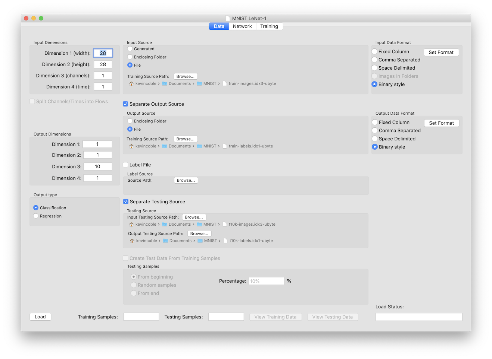

# Data Tab

The data tab is the starting point for all documents.  The tab is used to specify the size and format of the training and testing data, and to load the data once the definition (and possibly the network) is complete.

General workflow for the data tab is as follows:

1.  Define the input size
2.  Define the model type
3.  Define the output size
4.  Select the input source type
5.  Point to the files or directories to be used
6.  Specify the format of the data in those files
7.  (Optionally) Load the data

Each of these operations is detailed below:

## Defining the Input Size

To define the input size for the network, enter the four integer numbers in the Input Size block in the upper-left portion of the tab window.  The four numbers are subtitled with their usual use, but this is not a requirement depending on your data set.  The subtitles are for images or sets of images across time, with width being the first dimension, height the second, number of channels (1 for grayscale, 3 for RGB, 4 for RGBA) the third, and a rarely used time dimension for images that change over time like video frames.  If you are using a tabular data table, you would just put the number of input parameters as the first dimension, leaving the rest of the dimension ranges a 1.  Make sure to hit 'return' after each entry to have the value read and stored - changing tabs before doing this will result in the previous value still being used.

## Defining the Model Type

Neural network models can be one of two types:  regression or classification.  Regression is the conversion of a set of inputs to one or more result values.  An example would be suggested speed for an autonomous car given inputs of the speed limit, the road conditions, traffic, etc.  Classification is the determination of which category (class) a set of inputs belong to.  An example is to determine which digit a handwritten number is.  In that example, there would be 10 categories, one for each possible digit.

The Output Type block in the lower-left of the tab contains radio buttons to determine if the problem is one of regression, or on of classification.

## Defining the Output Size

To define the output size of the network, enter the four integer numbers in the Output Size block in the middle-left portion of the tab window.  When setting the output size, remember most networks use layer near the end that converts all the inputs fro the previous layer into the single output form.  These layers return their multiple outputs generally as a set of 1x1 channels.  This is especially true for classification networks.  For a classification network with 10 classes, the final output size is likely to be 1x1x16x1, with all entries a 1 except for dimension 3 (channels in this case).  Make sure to hit 'return' after each entry to have the value read and stored - changing tabs before doing this will result in the previous value still being used.

## Selecting the Input Source Type and Pointing to the Files or Directories To Be Used

These two operations are related, and cover all the controls in the middle portion of the tab.  Therefore they will be discussed together.

There are five sections on the Data Tab that can be used to completely define the data source:  The Input Source, the Output Source, the Label Source, The Testing Source, and the Testing Samples.  Only the Input source section is required, the other four start with a checkbox that indicates if that particular section is going to be used.

#### Input Source
The Input Source section starts with a radio button selection for where to get the data.  The three options are Generated, Enclosing Folder, or File.

If the Input Source type is 'Generated' an internal function is called to generate the data randomly based on the input and output sizes.  Inputs are randomly chosen between values of 0 and 1.  Outputs can be random values as well, or code can be added to the TrainingData class to generate data as needed for testing.  Currently an input size of 2x1x1x1 and output of 1x1x1x1 will result in a generated set for testing an 'OR" function, with the output being 1 if either input is greater than 0.5

If the Input Source type is 'Enclosing Folder' all files in the selected directory for the Training Source Path will be processed based on the Input Data Format selection (see here <link> for more information on specifying the file format).  The files are not guaranteed to be parsed in any particular order.  Do not have files that are not input files of the specified format in the directory.

If the Input Source type is 'File' the file selected for the Training Source Path will be processed based on the Input Data Format selection (see here <link> for more information on specifying the file format).

Use the Browse button to select the folder (if type is 'Enclosing Folder'), or the file (if type is 'File.').  Alternatively, drag-and-drop should work into the path display field under the browse button

#### Output Source
If the Input Data Format specified for the Input Source does not contain the output data, then a separate output source will need to be specified.  If this is the case, make sure the 'Separate Output Source' checkbox is checked and fill in this section.

The Output Source section starts with a radio button selection for where to get the data.  The two options are Enclosing Folder or File.

If the Output Source type is 'Enclosing Folder' all files in the selected directory for the Training Source Path will be processed based on the Output Data Format selection (see here <link> for more information on specifying the file format).  The files are not guaranteed to be parsed in any particular order.  Do not have files that are not output files of the specified format in the directory.

If the Output Source type is 'File' the file selected for the Training Source Path will be processed based on the Output Data Format selection (see here <link> for more information on specifying the file format).

Use the Browse button to select the folder (if type is 'Enclosing Folder'), or the file (if type is 'File.').  Alternatively, drag-and-drop should work into the path display field under the browse button

#### Label Source
If the Output Type <link> is classification, the input data may just have strings for the class that each input sample belongs to.  Since the network outputs a number, a translation is needed.  The Label File is used for this purpose.  Enable this section by checking the 'Label File' checkbox and select the file using the Browse button or drag-and-drop the file into the path display underneath the button.

A label file is just a text file containing strings, one per line, for each of the possible classes.  No other information, including comments, headers, etc. can be in the file.  Comparison of the strings in the input or output files is done without case sensitivity.

#### Testing Data
While not required, it is usual to have a set of data that is not used for training the network, but is instead used to test the accuracy of the network.  <bold>This data should not be the same as the training data, or you risk over-fitting your network.</bold>  There are two ways to get testing data; read a separate file or set of files that contain this data, or partition the previously read data into training and testing sets.  If there is separate testing data files, check the 'Separate Testing Source' checkbox and fill in the section.  To partition the data from the Input and Output Source sections into training and testing data, check the 'Create Test Data From Training Samples' checkbox and fill in that section

#### Testing Source
When reading separate testing data, the Testing Source section must be filled in.  The testing data is assumed to mirror the training data, and will use the same specifications for file/folder, Input Data Format, and if specified as a Separate Output Source the Output Data Format.  The Input Testing Source Path must be specified, either by using the Browse button or drag-and-dropping the file onto the path specifier.  If the Separate Output Source option was selected, an Output Testing Source Path must be similarly selected.

#### Creating Testing Samples
When partitioning training data into training and testing sets, the Testing Samples section must be filled in.

The testing samples will be selected from the training set, the number of which is given by a percentage value that can be entered.  Numbers in the range of 0.001 to 100.0 can be entered (although 100% will leave no training data).  The number of training samples is calculated then that many data samples are removed from the training set and put into the testing set.

The location where the samples are removed from the training set is given by a radio button selection.  They can come from the beginning, the end, or from random locations within the training data set.

## Specifying the Format of the Data

The Input Data Format must be specified for the input files, and if an Separate Output Source is being used, the Output Data Format must be specified as well.

Start by selecting the type of data.  A radio button selection gives the options of Fixed Column, Comma Separated, Space Delimited, Images in Folders, or Binary Style.  The Images in Folders option is only available for Input Data Formats (the output data is derived from the folder names), and only if 'Enclosing Folder' is selected for the Input Source Type.

Fixed Column, Comma Separated, and Space Delimited are for use with text files.  Text files assume there is one data sample per line in a text file.  Fixed Column means you will provide the column start and end locations for each input and output feature on the line.  Comma Separated and Space Delimited files assume each token on the line (tokens are split by commas or white-space depending on the type selected) will be specified as a feature, unused token, or output value in the format specification.

Images in Folders is used when you are training on image files (any image file readable by MacOS Core Image can be used) for classification.  Put all the images associated with each classification category into a folder, name that folder the class label, and put all of the class folders into a single folder that will be specified as the Training Source Path.  No other format specification is then required.

Binary Style is used when the data files are non-textual, with binary numbers (or strings for classification labels) are embedded in a byte stream.  The format of the byte stream must then be specified.

For all types except Images in Folders the Input Format, and if an Separate Output Source is being used, the Output Format must be set by using the Set Format button label in each box.  Instructions on how to specify the format are here<link>.

## Loading the Data
Once the input and output formats have all been specified, you can go on to another tab, or load the data.  Data must be loaded before training or testing on the third tab.

To load the data, click the 'Load' button in the lower-left.  The data is loaded in a background thread, with the progress shown in the Training Samples and Testing Samples count indicators.  The Load Status field will show what the status of the load process is, or the error if one is encountered in loading the data.  While loading, the controls on the tab are disabled.  When complete, the controls on the tab return.  Making any changes to the data format will invalidate the loaded data, and it will have to be reloaded with the new parameters.

Once the data is loaded, you can view the training or testing data by clicking on the View Training Data or View Testing Data buttons.  Information on the View dialog sheet can be found [here](DataView.md).