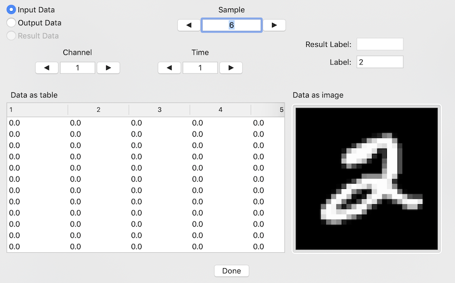

# Data View
After loading data, it can be viewed by clicking the "View Training Data" or "View Testing Data" buttons.  After testing your model on the testing data, the testing data and the test results can be viewed by clicking on the "View Test Results" button.  Any of these buttons activate the Date View sheet with the specified data.  An example of this sheet is given below, showing MNIST input data.

## Data Selection
All data sets, whether it is training or testing data, has input and output data.  Additionally, the post-testing data set has a duplicate of the output data that was produced by running the input data through the model.  This is called the result data.  The upper-left of the sheet has a radio button selection that allows you to choose which of these portions of the data set is to be viewed.  The 'Result Data' option will only be available for post-testing data sets.

The dimension of the input and output data is likely to be different.  When changing which data portion is to be viewed, the allowed dimension selection of the data will be changed.  If previously the viewed dimension was beyond that of the new viewed portion, the viewed dimension will be modified to an in-bounds value.

## Sample
At the top of the sheet is an enterable field with two arrow buttons that can be used to select the sample being viewed.  The entry field will take any integer value between 1 and the number of samples in the data set, inclusive.  The arrow buttons will decrement or increment the sample number, with wrapping when going below 1 or above the number of samples.

## Channel and Time
Above the data table are enterable fields with arrow buttons to set the currently viewed channel or time dimension.  Often times the time dimension count, or even the channel count, is 1, so that these controls will not have any affect.  If either of those dimensions can be other than 1, these controls will allow you to enter, decrement, or increment the dimension value currently being viewed.

## Data as Table
The lower-left portion of the sheet is a table view with the selected data.  It shows the values for the selected section, for the selected sample, for the selected channel and time indices, in a table with the dimension 2 indices as the rows, and dimension 1 varying through the columns.

## Label and Result Label
If the problem type is 'classification', the upper right field for Label will show the classification label for the currently selected sample, regardless of which data section, channel, or time is being displayed.  If the sheet was activated for testing results, the Result Label field will show the testing result classification label for the sample, also regardless of which data section, channel or time is being shown.

## Data as Image
The lower-right portion of the sheet has an image that shows the selected data section for the current sample as an image.  If the data has 1, 3, or 4 channels and only 1 time index, it will convert the data into a greyscale, RGB, or RGBA image respectively and show that.  If the data has 2 or more than 4 channels, or has more than 1 time index, the data for the currently selected channel and time will be converted into a greyscale image and shown.

Values that are less than 0.0 are clipped to 0 in the image.  Values greater than 1.0 are clipped to 1.