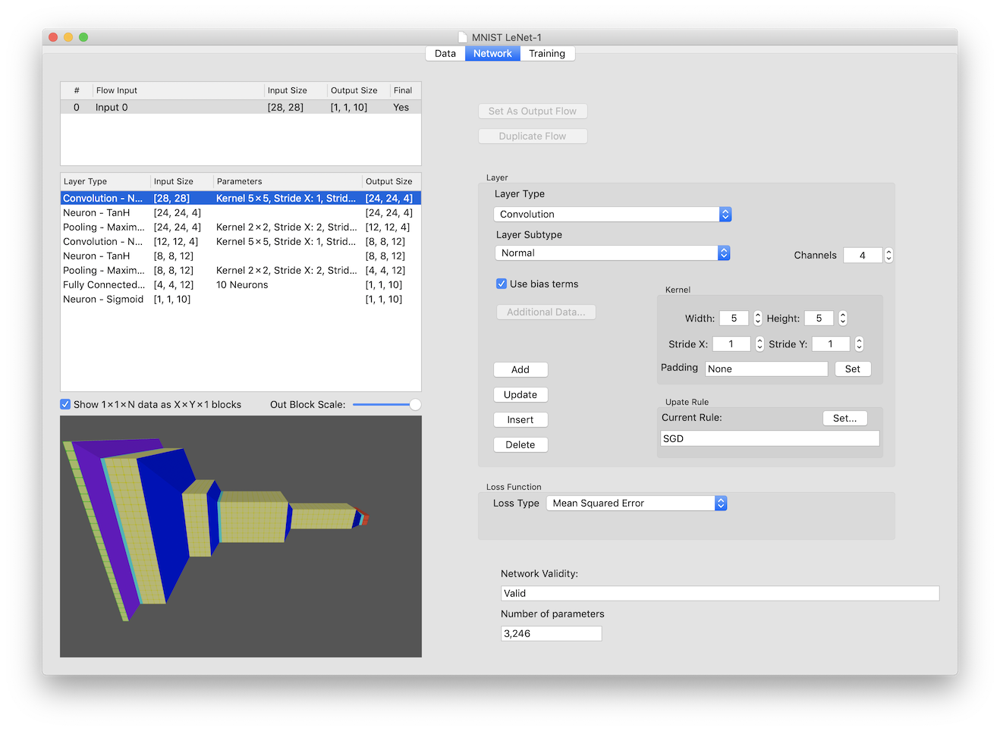

# Network Tab
The Network tab is used to configure the network topology for your model.  It uses the input and the output dimensions from the  Data tab to validate the network, so set those before defining your network.

## Flow Table
The top-left portion of the tab has the flow list.  A flow is a set of layers that independently process the inputs to the flow into the output.  Flows can have inputs that compine the results of other flows, allowing a multi-flow network (i.e. processing the red, green, and blue channels of an image independently).  The gradient split is only allowed on later versions of MacOS, so having more than one flow is not recommended at this time.

The table shows the flow, which input or inputs feed into the flow, the size of that input (combined if multiple inputs feed into this flow), and the output of the flow given the current layers and input size.

The flow to be worked on must be selected to add/delete/modifiy any layers within that flow.  By default, the single flow is selected by default.

One flow must be designated the 'Output Flow'.  The output of that flow is used as the output of the network (and must match the output dimensions for a valid network).  If only one flow is used, that flow will be the output flow by default.  If not, the 'Set As Output Flow' button can be used to make the currently selected flow the output flow.  When splitting inputs on the Data Tab, an output flow will be created automatically that takes all the other flows as the inputs.

Often you want multiple flows to have the same topology - the same layers with the same settings, just processing a different channel or time set.  Once you have one flow set as you want, you can select it and click the 'Duplicate Flow' button.  A dialog sheet will appear asking which flow to duplicate the selected flow into.  Once selected and the 'Duplicate' button is clicked, the layers for the selected flow will be duplicated and replace any layers in the destination flow.

## Layer Table
Underneath the flow table is the layer table.  This table shows the layer stack for the currently selected flow.  The layers are executed (when training or testing) from the top down.  The layer at the top gets the inputs to the flow, and the layer at the bottom gives the output for the flow.

Each line of the table is one layer.  A summary of the layer type is the left-most column, followed by the input size for the layer (calculated based on the flow input and any processing done by previous layers).  The third column summarizes any parameters entered for the layer, such as number of neurons, channels, or kernel sizes (the information is a summary, the 'Additional Data' button, Padding section, and Kernel entries must be examined when the layer is selected to get all the information about the layer).  The last column is the expected output size, given the input size and the parameters of the layer.

When a layer is selected, The parameters for that layer are put into the controls on the right side of the tab.  This can be used to duplicate a layer (using 'Insert' or 'Add') or modify certain settings for the layer (using 'Update').  The selected layer is also shown in the 3D View on the lower-left of the tab, with the layer color alternating between its' normal color (blue or cyan) and a magenta color.  Please be aware that after selection, layer parameters can be modified without them affecting the selected layer (unless the 'Update' button is used), so you may need to re-select the layer to be sure the parameters shown are for the layer if you have modified values with the controls in the Layer portion of the tab.

## 3D View
The lower-left portion of the tab has a 3D representation of the network model.  All data blocks are shown sized to match the data  with dimension one being the forward-backward axis, dimension 2 being the height of the object, and dimensions 3 and 4 multiplied together to give the left-right axis sizing.  Data blocks are shaded to show the actual dimensions if you look closely.

When initially drawn, the model is shown left-to-right, with the inputs drawn on the left in green, and the expected outputs on the right in red.  Any padding is drawn as a translucent yellow edge to the data block.  Intermediate data blocks (those between layers) are shown in yellow.  The layers themselves are blue or cyan, with blue being used for layers that can change the size of the data when processed, and cyan for those layers that do not modify data sizing (like neuron layers).  Blue layers will get a yellow intermediate data block before them, to show the sizing differences between the input and output data.

Layers can be clicked on in the 3D View to select them.  Selected layers alternate between their normal colors (blue or cyan) and magenta to be highlighted in the image.

Standard 3D user controls are enabled on the view.  Using dragging, scrolling, pinch-zooming, and other gestures on the view you can move and rotate the image shown.

#### Show 1x1xN data as XxYx1 blocks
This checkbox changes the 3D View from showing long-skinny 1x1xN boxes into more compact rectangular data.  For instance, a 1x1x10 result box would be drawn as a 5x2x1 box, making it fit on the image better.  While this makes the image more compact (especially for classification networks with many classes), it is a distortion of the actual data sizes, so is made optional.

#### Out Block Scale
This slider control changes the X-axis scale of the intermediate output data blocks that are drawn between layers to show the resulting size of each layer.  Some layers can have results that have an excessive X-axis size, such as when a fully-connected layer has 4096 channels of output.  The slider changes the scale of these blocks between 1% of normal size when at the left, to full size when at the right.

## Configuring a Layer
The following settings can be made when creating a new layer, or when updating a layers' settings:

#### Layer Type
The following layer types can be selected:
* Arithmetic (Not supported at this time)
* Convolution
* Pooling
* Fully Connected
* Neuron
* SoftMax
* Normalization
* UpSampling
* DropOut

When a layer type is selected, the drop-down menu list is configured with the layer sub-types, the kernel settings will be enabled or disabled depending on their use, the Padding setting controls will be enabled or disabled, the Update Rule controls will be enabled or disabled, and other layer controls will be configured according to the type.

#### Layer Subtype
Most layer types have sub-types.  A sub-type is a general setting for the layer that changes how it behaves, or the equation it uses for processing data.  The following sub-types are currently supported:

* Arithmetic - (no subtypes supported at this time)
* Convolution - Normal, Binary, or Transpose convolutions
* Pooling - Average, L2 Norm, Maximum, or Dilated Maximum
* Fully Connected - Normal or Binary weights
* Neuron - Absolute, ELU, Hard Sigmoid, Linear, PReLU, ReLUN, ReLU, Sigmoid, SoftPlus, SoftSign, TanH, Exponential, Logarithm, or Power
* SoftMax - Regular or Logarithmic
* Normalization - Cross Cannel, Local Contrast, Spatial, Batch, or Instance
* Upsampling - Bi-Linear or Nearest

Each sub-type can have different parameters, so watch the '[Additional Data](AdditionalData.md)' button and if enabled after changing the sub-type click it to see what needs to be entered.

#### Channels/Neurons
The number of neurons in a fully-connected layer, or the number of output channels for a convolutional layer can be entered in the field (or using the stepper control) to the right of the sub-type entry control.

#### Use Bias Terms
For layer types that have parameter weights (fully-connected and convolutional layers), a checkbox is enabled below the sub-type selection to allow you to select whether optional bias terms will be added to the layer.

#### Additional Data
Some layer types and sub-types have additional parameters that need to be set for their operation.  For example, the slope and intercept must be configured for a Neuron sub-type of 'Linear'.  If there are additional parameters, the 'Additional Data...' button will be enabled.  Clicking on it will activate a dialog sheet containing the additional parameters that are applicable to the currently selected layer type and sub-type.  A list of additional parameters needed for each sub-type can be found [here](AdditionalData.md).

### Kernel Settings
Convolutional and Pooling layers operate by passing a 2-dimensional kernel (3-dimensional with all input layers included for convolutional layers) across the 2D representation of the input layer.  The sizing of this kernel can be specified in the Kernel portion of the Layer settings

#### Width and Height
The width is how far the kernel extends in dimension 1.  The height is how far the kernel extends in dimension 2.  For pooling layers the depth is 1, and for convolutional layers the depth matches the input data depth (dimension 3 multiplied by dimension 4).  Therefore pooling layers will not affect the data depth, while convolutional layers will result in a depth equal to the number of output channels selected.   Currently the width and height of the kernel is limited to odd values for convolutional layers, but can be any positive value for pooling layers.

#### Stride X and Stride Y
The stride is how far the kernel moves each step (in dimension 1 for the X stride, and dimension 2 for the Y stride).  The kernel is moved across the data starting at the first position (what that is depends on the padding settings) and having the stride added for each step.  A stride of 1 moves the center of the kernel across each possible location, while a stride of two will skip every-other location.  After setting the kernel size and stride, it can be instructional to go to the [Padding dialog sheet ](Padding.md)to see the example input and output figures to see what will happen.

#### Padding
By default, a layer that uses a kernel is set to have padding of 'Valid Only', so that no padding data is added to the inputs going into the layer.  Other padding options can be configured using the [Padding dialog sheet](Padding.md) activated by clicking on the 'Set'  button next to the Padding description string.  The current padding settings for the layer are summarized and put into the padding description string.  If the description is blank, then 'Valid Only' settings are being used for all dimensions.

### Update Rule
Layers that have trainable parameters (fully-connected and convolutional) can have an update rule specified for how those parameters are modified in the training process.  A summary of the update rule is shown in the text field for the current rule.  The update rule can be set using the [Update Rule dialog sheet](UpdateRule.md) that can be activated using the 'Set' button in the Update Rule box in the Layer configuration area.

### Layer Operations
#### Add
The 'Add' button will take the current layer settings (type, sub-type, kernel, padding, additional information, and update rule) and create a new layer that is added to the end of the currently selected flow.  A layer can be copied by selecting one, which will set the controls to that layers settings, and then using the 'Add' (or 'Insert') button.

The flow output sizes and network validity will be recalculated and displayed after the layer is added.

#### Update
The 'Update' button can be used to change the settings of the currently selected layer.  Once a layer is selected and the controls have the current settings for that layer, you can make the changes desired and then click the 'Update' button to store those changes into the layer.

The flow output sizes and network validity will be recalculated and displayed after the layer is updated.

#### Insert
The 'Insert' button will take the current layer settings (type, sub-type, kernel, padding, additional information, and update rule) and create a new layer that is inserted in the currently selected flow just before the selected layer.

The flow output sizes, following network input and output sizes,  and network validity will be recalculated and displayed after the layer is inserted.

#### Delete
The 'Delete' button will remove the currently selected layer from the flow it is contained in.

The flow output sizes, following network input and output sizes,  and network validity will be recalculated and displayed after the layer is deleted.

## Loss Function
Use this drop-down menu to select the loss function to be used for the network.  The loss function is the final calculation when training that takes the output of the network and the expected values for the output and determines an error value, called the loss.  This loss is the value that is minimized by the training.  The gradient for the loss is calculated, and the parameters of the network are modified to try to minimize the loss value.

Possible settings for this are:
* Categorical Cross-Entropy
* Cosine Distance
* Count
* Hinge
* Huber
* Kullback-Leibler Divergence
* Log
* Mean Absolute Error
* Mean Squared Error
* Sigmoid Cross-Entropy
* SoftMax Cross-Entropy

## Network Validity
After each change to the network topology or the layer settings, the validity of the network is determined.  A network is valid if  the size of the input dimensions fit the layer settings for the first layer, each layers output fits the settings of the next layer, and the resizing of data performed by the layers results in a final data output that matches the output dimensions given.  

The result of the validity check is shown in the Network Validity field on the Network tab.

## Number of parameters
After each change to the network topology or the layer settings, the number of parameters used by the network is calculated and displayed in this field.  The number of parameters is the total number of weight and bias terms used by all layers.  It can give a rough estimate to the complexity, and hence the speed of training, of a network.