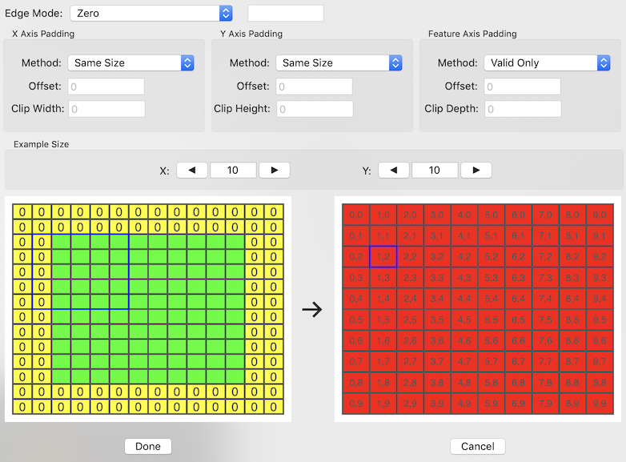

# Padding
Convolutional and Pooling layers process a kernel across a two-dimensional grid of your data (input dimensions 1 and 2).  Often this kernel is larger than a 1x1 square.  Depending on your network you may want to start the kernel in the corner, which leaves the question as to what to do with the portions of the kernel that extend beyond the edge of the data.  To specify those conditions, these layer support setting a Padding Policy.  The current padding policy is shown on the Network Tab for the currently selected layer, and clicking on the 'Set' button next to that policy string in the Kernel section of the tab will activate the Padding dialog sheet, shown below:

## Edge Mode
When the kernel extends beyond the edge of the data, the values underneath the kernel in those locations has to be generated.  What values are used is determined by the Edge Mode.  There are five possible settings for this value.

| Mode | Description |
| --- | --- |
| Zero | All padding values are 0 |
| Clamp | The edge data values are extended out |
| Constant | A constant value (enterable) is used (MacOS 10.14.1)|
| Mirror | The edge data values are mirrored (inverted) (MacOS 10.14.1) |
| Mirror with Edge | &lt;Not sure what this one does&gt; (MacOS 10.14.1) |

As I have yet found a way to set the edge mode if the program is using the 'node' versions of the convolutional layers if you do not use custom padding (destinationImageDescriptor is not called on the Padding Policy object in those cases), only 'Zero' is currently supported.

## Axis Padding
Pooling layers maintain the channel (and time) structure of the data, while Convolutional layers will combine the channel and time data for each kernel placement, and output dimension 3 values based on the number of channels the layer has been configured to produce.  Because of this, there are three axis to specify padding rules for for convolution layers, while only the first two (X and Y axis) will be used by pooling layers

#### Method
You must specify the padding method for each needed axis for the layer.  The following options are selectable:

| Method | Description |
| --- | --- |
| ValidOnly | The kernel will only be used at locations where there is valid input data underneath all locations.  This will reduce the size of the data by (kernel size-1)/2 on each side |
| Same Size | The data will be padded using the edge mode to create an output size that matches the data input size.  Padding will be (kernel size-1)/2 on each side |
| Full Size | The data will be padded using the edge mode to allow the kernel to extend to the edge with only 1 input data item underneath.  Padding will be (kernel size-1) on each side |
| Custom | You specify the starting offset and clipping end (approximately the size, depending on the stride) yourself.  Padding will be dependent on these entries. |

#### Offset
For custom paddings, this is the offset the kernel will start from.  The value can be negative to start off the edge (padding required) to the left or above the data grid.

#### Clip Width/Height/Depth
For custom paddings, this is the size the kernel will traverse in the dimension you are entering this value for.

## Example
The lower portion of the sheet shows an example of the padding and resulting array.  It is shown only for the first two dimensions.  The kernel size and the stride settings are pulled from the layer settings before the sheet is activated, so it is best to set those values before entering padding information.

#### Example Size
The size of the example is specified by the values at the top of the example area, with increment and decrement buttons to either side.  Drawing the full data size for some layers would make for a crowded and too-small display, so it is best to see what will happen with a smaller input dimension.  The size specified is the size of the unpadded input (shown in green on the left-side input display)

#### Input/Padding Example
The lower-left portion of the sheet shows the input data (sized for the example, not the actual data) in green, with any padding being added shown in yellow at the edges.  The padding will be labeled with zeros for an edge mode of zero, the entered value for a constant edge mode, and letters that match up with values in the data portion that will be used to fill in those padding locations for the other edge modes.  Some letters are re-used.  This does not mean the values will be duplicated across the data.  Match a padding location to the closest matching letter to determine what value will be duplicated.

#### Output Example
The diagram on the right shows the resulting size of the operation (for the first two dimensions), based on the current kernel size, stride, and padding settings.  The image is in red (to match output in the 3D network view), with dimension coordinates drawn in each box if sizing allows.

Clicking on a rectangle in the output example will highlight it with a blue box.  The corresponding input locations (based on the current kernel and stride settings) will then be highlighted with a blue box on the input/padding example area.
