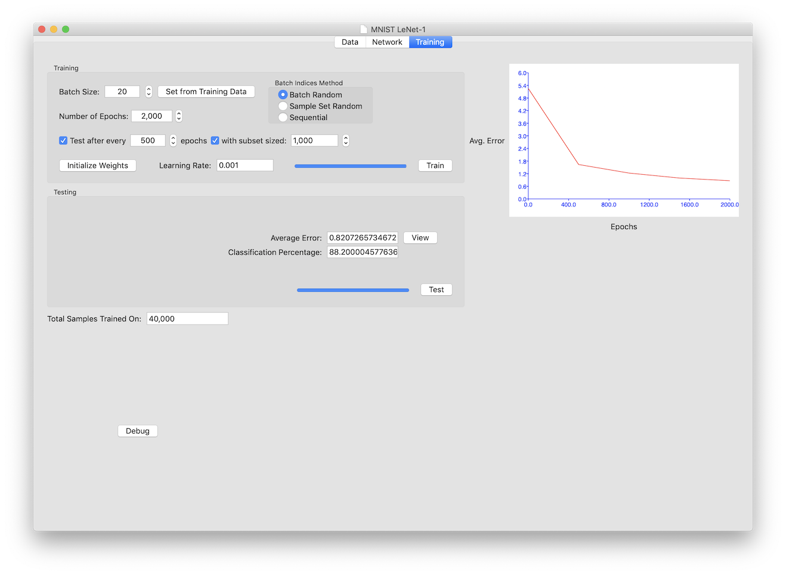

# Training Tab
There are two things you can configure and do on the training tab.  You can train the network, and/or you can test the network.  Both require the appropriate data to be loaded, and the network to be defined.

## Training
The training section is used for training your network
#### Batch Size
The batch size is the number of samples the network will be trained on before weights and bias parameters are updated.  The gradient is accumulated for the batch, so all samples in the batch are part of the update.  Since parameter updates take time (they are loaded to the CPU from GPU), smaller batch sizes will run slower.  Larger batch sizes can 'wash out' individual sample effects, so finding the right batch size is one of those hyper-parameter settings that must be considered.
#### Batch Indices Method
When selecting training samples to use in the batch, the batch indices method is used.  If the radio selection is set to 'Batch Random', each sample is chosen randomly from the training set - with equal probability for each batch item.  If the selection is 'Sample Set Random', the entire training set is shuffled, and then each batch for all the epochs uses the shuffled indices in order, until the sample set is exhausted, at which time the sample set will be reshuffled for the next epoch.  If the selection is 'Sequential', the training set is used in the loaded order, with the indices used wrapping back around to the first sample if the set is exhausted during the training session.

#### Number of Epochs
When a training session is started, a batch is created (based on the batch size) and the network is trained on it, doing a single update of the weights and biases for that batch.  This operation is called an epoch.  A training session will run for the number of epochs specified.  Training parameters like learning rate and testing during training cannot be changed during a training session, but multiple sessions can be used on a network, with different parameters for each.

#### Testing During Training
To monitor how training is progressing, it is possible to do testing between epochs.  To enable this, check the 'Test after every' checkbox, and specify the number of epochs between tests.  A testing session is done before the training starts, and again after the number of epochs specified.  The results are plotted in the Error Plot.  For performance reasons, you may want to do during-training testing on a subset of the testing data.  To do this, check the 'with a subset sized' checkbox and enter the number of testing samples to be used in the field following it.

#### Initializing Weights
Weights for the network will be automatically initialized before the first training or testing session.  After that you can use the 'Initialize Weights' button to re-initialize the values.  As all training will be lost, you will be asked to confirm the operations.  The total samples trained on and the Error Plot will be cleared when weights are initialized.

#### Learning Rate
The learning rate entry is the overall learning rate for the network.  The value entered is multiplied by the layers' learning rate multiplier to give the learning rate for that layer.  The learning rate can be changed between training sessions, but is constant during one (for all epochs in the training run).

#### Training
Clicking on the 'Train' button will start a training session for your network.  Training will continue until the number of epochs specified have been run.  If testing is indicated during training, the Error Plot will show the average error as training progresses.

A bar chart is updated as training progresses.  Since training is done in another thread, the interface will remain functional during the test.  The 'Train' button will change to a 'Stop' button.  Clicking it will stop the training at the end of the current epoch.

## Testing
The testing section is used to do a full test of your network.  It cannot be used while training is being performed.
#### Testing
Clicking on the 'Test' button will start a test session for your network.  The entire testing sample set will be run forward through your network.  The results are compared to the expected output.  The average error, and if the network type is a classification problem the classification percentage is calculated and displayed.  Once testing is performed it is possible to view the individual results if desired

A bar chart is updated as testing progresses.  Since testing is done in another thread, the interface will remain functional during the test.  The 'Test' button will change to a 'Stop' button.  Clicking it will stop the test at the end of the current testing batch.

Currently the testing is done with the same batch size as the training.  As this does not affect the result (no parameter updating is being done), it can alter the amount of time it takes to complete a testing session.
#### Viewing the Test Results
After training, the View button will become enabled.  Clicking on this will activate the [Data Viewer](DataView.md) window showing the testing data with the results of the test included.  
## Error Plot
To the right is a plot window for the results of any testing performed while training.
## Debug Button
There is a debug button on the Training Tab.  I use it for quick-access to code when working on the program.  Unless you are in modifying the software, I recommend ignoring the button.  If I remember, I will disable the button before pushing the code out each time.