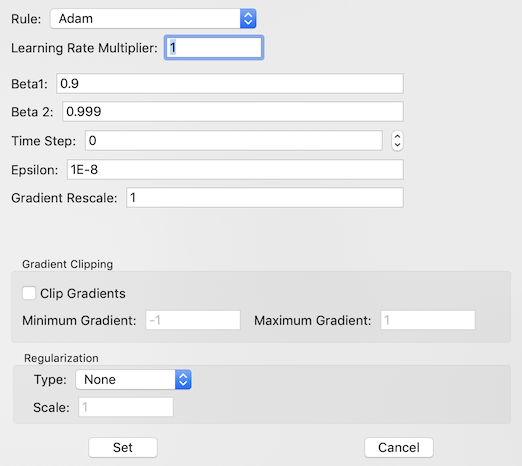

# Update Rule Sheet
For each layer that has update parameters (weights and/or biases), you can specify how those parameters get updated when the gradient is being worked backwards through the network while training.  When one of those types of layers (mostly convolutional or fully-connected layers) is selected, the 'Set' button in the Update Rule section of the Network tab will be enabled.  Clicking on this button will activate the Update Rule dialog sheet, shown below.  This section of the manual describes how to use this sheet.

## Update Rule
At the top of the sheet is the selection for the update rule.  There are three possible selections; Stochastic Gradient Descent (SGD), RMSProp, and Adam.  It is beyond the scope of this manual to describe what each of these rules does, but plenty of information can be found on the internet.  When selected, the parameter list between the Learning Rate Multiplier and Gradient Rescale setting will change to the options and settings that are available with the selected update rule.  A different update rule can be applied to each layer, if desired.

## Learning Rate Multiplier
Each layer has a Learning Rate Multiplier that is combined with the general Learning Rate supplied by the Training Tab to give the learning rate used by the layer.  This allows you to scale the learning rate differently for each layer, but still control the overall learning rate (for learning rate decay, etc.) from the Training Tab.

## Learning Rule Parameters
After the Learning Rate Multiplier are the options for the learning rule.  Below are the configuration parameters for each of the update rules:
#### Stochastic Gradient Descent

| Parameter | Description |
| --- | --- |
| Momentum Scale | Amount of momentum (from previous gradients) added to each gradient before the update.  If 0, momentum is not used |
| Use Nesterov Momentum | If checked, momentum is added to the gradient using the Nesterov method |

#### RMSProp
| Parameter | Description |
| --- | --- |
| Decay | Amount the gradient-squared term is decayed before being used to update the gradient values |
| epsilon | The minimum value for the divisor in the update term |

#### Adam
| Parameter | Description |
| --- | --- |
| Beta 1 | Ratio/decay factor for the first moment |
| Beta 2 | Ratio/decay factor for the second moment |
| Time Step | Time step for the update |
| epsilon | The minimum value for the divisor in the update term |

## Gradient Rescale
The gradients are multiplied by this value before the update.  This term is likely used for scaling multi-flow gradients.  For most cases, the value should be 1.

## Gradient Clipping
If the gradient clipping checkbox is on, then each of the calculated gradients for the layer will be limited to be between the minimum and maximum clipping values provided.  If above the maximum, the gradient is set to the maximum value.  If below the minimum, the gradient is set to the minimum value.

## Regularization
The weights can be regularized using L1 or L2 means by selecting that regularization style (select 'None' to not use regularization).  The strength of the regularization term is then set using the scale parameter entered int the Regularization section of the sheet.